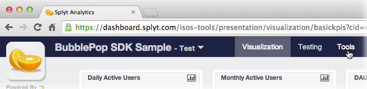

# Splyt SDK for Android

This SDK is intended for use in an Android-based applications and is built using the [Android SDK](http://developer.android.com/sdk/).

The sample application in this SDK was tested using the Android Developer Tools (ADT) Bundle, which is a version of Eclipse preconfigured with Android Developer Tools.  The version used in testing was ADT 22.3 together with an emulator running Android 4.3.

***

## Sample Application and Setup

The SDK includes a sample application called BubblePop.  BubblePop is a very simple [Shell Game](https://en.wikipedia.org/wiki/Shell_game) that demonstrates basic Splyt integration.  It also provides a simple examples of incorporating Splyt's plugins.

To view and run this sample:

1. Start Eclipse with Android Developer Tools
2. Open a workspace
3. Import the sample project
    * Click **File | Import...**
    * Choose **General | Existing Projects into Workspace**
    * Click **Next >**
    * Make sure **Select root directory** is checked, then click **Browse...**
    * Browse to the folder where you extracted the Splyt SDK for Android, and then select the `samples` subfolder.  Click **Open**
    * In the **Projects** list, **BubblePop** should now be listed.  Make sure it is checked, and then click **Finish**
4. In the **Package Explorer** window, right-click on the *BubblePop* node at the top of the tree view.  Then select **Debug As | Android Application** to start a debug session of BubblePop running under the Android emulator.

## Integration

Integrating Splyt involves adding code to your application that:

1. Prepares Splyt to start receiving data.  In these *initialization* steps, you will inform Splyt of the device and/or user running the app, and begin a session.
2. Add *instrumentation* code that sends data to Splyt describing how the user is engaging with your app.
3. Optionally, use Splyt's *tuning and testing* system to make dynamic virtual economy decisions and add A/B tests to your app.

Each of these integration steps are covered in more detail, below.

### Initialization

To prepare Splyt for use:

1. First, **Initialize Splyt** as early as you can by setting the customer ID, as well as the device and/or user IDs:

        Splyt.Core.InitParams initParams = Splyt.Core.createInitParams(this, SPLYT_CUSTOMER_ID, mSplytInitListener).setLogEnabled(true);

    ...where:

    * `SPLYT_CUSTOMER_ID` is a Java string constant.  The value of this string is a customer ID provided to you by the Splyt team.
    * `mSplytInitListener` is a `SplytListener` interface reference.  This interface exposes a single method, `onComplete`, which is called after Splyt initialization is complete.

2. After initialization is complete, **begin a session**.  As early as possible in your application's boot flow, use the Session plugin and call:

        SplytPlugins.Session.begin();

    ...to mark the beginning of a period of activity.  The BubblePop sample shows how this method can be called from a `SplytListener.onComplete()` callback, which is invoked after the Splyt core is initialized.

In order for sent data to be valid, you will need to have at least one of the user OR device IDs set.  If you do not specify a device ID, one will be requested for you from the Splyt servers and stored on the device (in local storage) for reuse in subsequent sessions.  Please see the API documentation and the BubblePop sample for more information.

Note that at any point after initialization, the device and/or user IDs can be set using `Splyt.Core.setDeviceId()` and `Splyt.Core.setUserId()`, respectively.  This is useful, for example, if you have a login flow and do not have a user ID at initialization but at some point after.  In this case, data before login will be linked only to a device ID and after the user ID is known, to both a device ID and a user ID.

3. In each Activity in which you intend to instrument with Splyt.  Be sure and override the onPause() and onResume() methods and add calls to Splyt.Core.pause() and Splyt.Core.resume(), respectively.  This will reduce the risk of data loss.

### Instrumentation

Instrument your application using the additional plugins provided in the SDK, where possible.  Refer to the the sample application for examples.

Here are few best practices to keep in mind:

* You must specify the user ID and/or device ID that the telemetry data is associated with.  You can do this by:

    1. Call `Splyt.Core.createInitParams` (as demonstrated in `MainActivity.java` in the Bubblepop sample)
    2. Call `Splyt.Core.setUserId()` and/or `Splyt.Core.setDeviceId()` on the `Splyt.Core.InitParams` instance that was returned by the previous step.
    3. Pass the `Splyt.Core.InitParams` instance to `Splyt.Core.init`

    ...if you do not specify a user ID or a device ID, the effective user ID will be `null`, and a device ID will be auto-generated.

*   If you do have both a user ID and a device ID, and you find yourself calling `Splyt.Instrumentation.updateUserState()`, you should also call `Splyt.Instrumentation.updateDeviceState()` with the same arguments.

*   You should update your user/device's state at the earliest possible moment that you can.  Further, to the extent that you can, you should always update user/device state before opening a new transaction.

    Taking purchasing as an example, the first block of code is preferable to the second.  The reason being that we want the purchase to be associated with the known user state at the time of the purchase.

        // First  : Preferred
        Splyt.Instrumentation.updateUserState(userProperties);
        SplytPlugins.Purchase.recordPurchase(purchaseProperties, Splyt.TXN_SUCCESS);

        // Second : Avoid
        SplytPlugins.Purchase.recordPurchase(purchaseProperties, Splyt.TXN_SUCCESS);
        Splyt.Instrumentation.updateUserState(userProperties);

*   You should apply all transaction properties to a transaction at the earliest moment that you can.
Do not defer updates to the property collection passed to `Splyt.Instrumentation.Transaction.setProperties()` to a later state of progress than is necessary.

### Tuning & Testing

If you are utilizing the tuning system, you will want to cache the tuning variables for a given user and device.  It is recommended you do this as early as possible in the flow and block on the call so you can be sure that everything is ready to go.  The following example shows one way to do this.

        _initGame();

        // Retrieve the tuning values.
        //
        // Since you do not want the game to proceed without having the actual tuning values,
        // you can provide a callback for when the call finishes.
        Splyt.Tuning.cacheVariables(new SplytListener()
        {
            @Override
            // This function is called when Splyt finishes its initialization
            public void onComplete(SplytErrors error)
            {
                // Even if "myVar" cannot be retrieved, 1.0 is used as a default value.
                mTuningVar = Splyt.Tuning.getVar("myVar", SplytConstants.ENTITY_TYPE_DEVICE, Float.valueOf(1.0f)).toString();

                // Now that we have a value for mTuningVar, we can start the game
                _startGame();
            }
        });

## Adding Splyt to Your Project

* Add the `sample/BubblePop/libs` folder to the project.
* In the project's properties (accessible from the **Project | Properties** menu item):

    1. Click on **Java Build Path** on the left-hand side of the Properties window.
    2. In the right-hand side, click on the **Libraries** tab and click **Add External JARS...**.
    3. Browse to the `libs` folder you added to the project, and add:

        * `splyt-android.jar`

    4. Click on the **Order and Export** tab, and make sure each of the libraries you added in the previous step is checked.
    5. Click **OK** to close the project Properties window.

### Javadoc Location

Javadocs for each Splyt plugin may be found under `samples/BubblePop/libs/docs/**/html`.  When Splyt jars are added to your Eclipse project using the steps above, tooltip documentation and autocomplete for Splyt is automatically enabled.

Getting Started
=========

Last Updated: March 4, 2104

## Adding the Library to Your Project

The BubblePop sample project included with this SDK was preconfigured to use SPLYT's Android library.

When adding SPLYT to your own app, you will need to add this library to your project. The easiest way to do this is to create a directory named `libs` in the root directory of your project, if it does not already exist.  Then copy the contents of this SDK's `.\libs` subfolder of this SDK to the `libs` directory of your project.

The contents of the SDK's `libs` subfolder include:

* `splyt-android.jar` - the SDK's main `.jar` file
* `splyt-android.jar.properties` - points to the SDK's Javadoc-based documentation for code completion support when working in Eclipse.
* `docs` - a subfolder containing the SDK's Javadoc-based documentation.

## Adding Telemetry to Your App

Once SPLYT's Android library has been added to your project, you'll want to add code to your app to send information to SPLYT.

The following sections provide a quick overview of the APIs available from the SPLYT library.

### Singleton Instances

Static classes provide access to the functionality that you'll use the most often:

|          Class          |                                                    Description                                                     |
| ----------------------- | ------------------------------------------------------------------------------------------------------------------ |
| `Splyt.Core`            | Provides access to the most central pieces of the SPLYT framework.                                                 |
| `Splyt.Instrumentation` | Provides access to factory methods for custom transactions, as well as methods for updating device and user state. |
| `Splyt.Tuning`          | Provides access to SPLYT's dynamic tuning variables, used in A/B testing and targeting.                            |
| `SplytPlugins.Purchase` | Provides factory methods for creating transactions that describe in-app purchases.                                 |
| `SplytPlugins.Session`  | Provides factory methods for creating transactions that describe app sessions.                                     |

See the BubblePop sample in the `samples` subfolder of the SDK for examples of how these classes get used in an app.

### Initialization

SPLYT should be initialized as early as possible in your app's startup sequence. SPLYT must be initialized before you start sending telemetry or referencing tuning variables defined in SPLYT.

For Android apps, the logical spot to initialize SPLYT is often in the `onCreate` method of your app's default/starting activity.

Note that the initialization calls a listener upon completion, after which point you can reliably use any of the other calls in the SPLYT SDK. Here's an example, passing `Splyt.Core.InitParams` to `Splyt.Core.init`:

    // contact SPLYT if you do not have a customer ID
    private static final String SPLYT_CUSTOMER_ID = "mycompany-myproduct-test";

    Splyt.Core.InitParams initParams = Splyt.Core.createInitParams(this, SPLYT_CUSTOMER_ID);

    Splyt.Core.init(initParams, new SplytListener() {
        @Override
        public void onComplete(SplytError error) {
            // This function is called when SPLYT finishes its initialization
            if(error != SplytError.Success)
                logError("SPLYT initialization failed!");

            // Wait until Splyt has finished initializing so that instrumentation calls in the app
            // work properly. In most cases you will want to allow the application to run even
            // if init fails; however, in those situations the tuning and instrumentation will not work.
            SplytPlugins.Session.Transaction().begin();
            _startApp();
        }
    });

### Devices

SPLYT will automatically track some hardware information about your device, but if you have additional (perhaps application-specific) properties to report, you can do so at initialization time.  To do this, use `Splyt.Core.createDeviceInfo` to create an info object that describes the device, and then set that object as part of your `InitParams`:

    Splyt.Core.EntityInfo deviceInfo = Splyt.Core.createDeviceInfo()
        .setProperty("screen_orientation",   "landscape")
        .setProperty("internal_lib_version", lib.version);

    Splyt.Core.InitParams initParams = Splyt.Core.createInitParams(this, SPLYT_CUSTOMER_ID).setDeviceInfo(deviceInfo);

    Splyt.Core.init(initParams, listener);

To report any changes to the state of the device at any later point, see `Splyt.Instrumentation.updateDeviceState`.

### Users

Many applications track individual users with some form of user ID. For such applications, if you know the user ID at startup, it is recommended that you use `Splyt.Core.createUserInfo` to create an info object that describes the user, and then set that object as part of your `InitParams`.

You can also use the `setProperty` and `setProperties` methods of the info object to include additional properties that describe the user:

    Splyt.Core.EntityInfo userInfo = Splyt.Core.createUserInfo(user.id)
        .setProperty("lifetime_spend",   user.lifetimeSpend)
        .setProperty("friend_count",     user.facebookProfile.friendCount);

    Splyt.Core.InitParams initParams = Splyt.Core.createInitParams(this, SPLYT_CUSTOMER_ID).setUserInfo(userInfo);

    Splyt.Core.init(initParams, listener);

If the user is *not* known at startup, they can be registered at a later point by creating a SplytEntityInfo instance in the same fashion as above and then passing it to SplytCore::registerUser:andThen:

    Splyt.Core.registerUser(userInfo,  new SplytListener() {
        @Override
        public void onComplete(SplytError error) {
            // The app may now safely log telemetry and use tuned variables for the user
        }
    });

Additional notes:

* For applications which allow multiple concurrent users, see `Splyt.Core.setActiveUser`
* For applications which need to support users "logging out", see `Splyt.Core.clearActiveUser`
* To report any changes to the state of the user at any later point, see `Splyt.Instrumentation.updateUserState`:

### Telemetry

#### Transactions

Transactions are the primary unit of telemetry in SPLYT. Reporting events with a `Transaction` object is simple, but powerful. Consider:

    Splyt.Instrumentation.Transaction("UserAction").begin();

    // Time passes...

    Splyt.Instrumentation.Transaction("play_game").setProperty("something interesting", "about the transaction");
    Splyt.Instrumentation.Transaction("play_game").end();

Note that properties of the transaction may be set at the beginning or end of the transaction, or at any point in between as part of an `update`, but as a best practice, transaction properties should be reported as early as their value is known or known to have changed.

To handle the somewhat common case where a transaction occurs instantaneously, use the `Splyt.Instrumentation.Transaction.beginAndEnd` method.

Also note that the setting of transaction properties is only persisted after a call to one of the `begin`, `update`, `end`, or `beginAndEnd` methods of `Transaction`.

#### Collections

Collections in SPLYT are an abstraction for anything the user of the application might accumulate or have a varying quantity of. Common examples of this might be virtual currency, number of contacts, or achievements. `Splyt.Instrumentation.updateCollection` can be used at any point where the quantity
of a collection is known to have changed:

    // The user's friend count has decreased by 2 to 27.  friend count is NOT a currency.
    Splyt.Instrumentation.updateCollection(friendCount, 27, -2, NO);

It is recommended to instrument all of the important collections in the application, as they will add surprising power to your data analysis through contextualization.

#### Entity State

As previously mentioned, users and devices (commonly referred to as "entities" in SPLYT) may have their state recorded during initialization, or at a later point in the app by calling `Splyt.Instrumentation.updateUserState` or `Splyt.Instrumentation.updateDeviceState`, respectively. Reporting
changes in entity state is another great way to unlock the power of contextualization.

### Tuning

SPLYT's tuning system provides a means for dynamically altering the behavior of the application, conducting an A/Z test, and creating customized behavior for segments of your user base (targeting).  The instrumentation is very simple, and the hardest part might be deciding what you want to be able to tune. When initialized, SPLYT will retrieve any dynamic tuning for the device or user. At any point thereafter, the application may request a value using `Splyt.Tuning.getVar`:

    // before SPLYT
    String welcomeString = "Hi there!";
    float welcomeDuration = 3.0f;

    // with SPLYT tuning variables
    String welcomeString = Splyt.Tuning.getVar("welcomeString", "Hi there!");
    float welcomeDuration = Splyt.Tuning.getVar("welcomeTime", 3.0f);

Note that we specify a default value as part of the call to `getVar`. It is important to provide a "safe" default value to provide reliable behavior in the event that a dynamic value is not available. This also allows for the application to be safely instrumented in advance of any dynamic tuning, targeting, or A/Z test.

In addition to instrumenting key points in your code with `getVar`, applications which may remain running for long periods of time are encouraged to use `Splyt.Tuning.refresh` in order to make sure that the application has access to the latest tuned values at any point in time. A typical integration point for `refresh` on a mobile app might be whenever the application is brought to the foreground, and the code for handling it is quite simple:

    Splyt.Tuning.refresh(new SplytListener() {
        @Override
        public void onComplete(SplytError error) {
            // At this point, tuning for the device and any and all registered users should be refreshed.
        }
    });

It is not necessary to block for the completion of this call, as is typically recommended for `Splyt.Core.init`
and `Splyt.Core.registerUser`, since the application should already have access to viable tuned variables prior to the call to
`refresh`.  However, the callback is provided, leaving it to the discretion of the integrator.

### Mobile Apps

For mobile apps, it is likely that the app may become active and inactive many times during it's lifetime. In addition, it is best practice to ensure that applications can function properly under poor network conditions, or even when the device has no network connection. In order to support these characteristics, the SPLYT SDK is designed to protect your telemetry in these situations. However, there's a small bit that needs to be done by the implementor.

When the application is becoming inactive, call `Splyt.Core.pause`.  For example, the BubblePop sample does the following from the `onPause` method of `MainActivity`:

    @Override
    protected void onPause()
    {
        super.onPause();

        // This activity is being paused; pause Splyt so that it can save off any events queued up to reduce the risk of losing data
        Splyt.Core.pause();
    }

And then when it becomes active again, call `Splyt.Core.resume`:

    @Override
    protected void onResume()
    {
        super.onResume();

        // This activity is resuming; tell Splyt to resume normal operations
        Splyt.Core.resume();
    }

If necessary, you can still report telemetry while SPLYT is in a paused state, but the telemetry calls may execute more slowly, due to data being read and written from the device's local storage.

Using the BubblePop Sample
=========

Last Updated: March 4, 2014

## Introduction

The SDK includes a very simple Android game that exercises some of the features of SPLYT.  This serves as a good starting point for many new users.  By stepping through the sample code, you can see how the SPLYT APIs are called.  Furthermore, you can use our SDK Debugger tool to verify that telemetry sent by these APIs is received by SPLYT.

BubblePop is an extremely simple game that sends data to SPLYT.  In this game:

* You have a balance of virtual currency, referred to as "gold".
* To play a game, you need to spend some of your gold.
* In the game, you click on bubbles to pop them.  One of these bubbles is a "winning" bubble.  The goal is to find that bubble before it is the only one left.
* You can also add more gold to your account by making an in-app purchase (don't worry -- in this sample game, you don't actually have to spend money make an in-app purchase!).

Admittedly, this game is not technically impressive; nor is it even all that much fun!  It simply exists to illustrate the steps involved in implementing SPLYT in an app.

The following steps walk you through the process of running the BubblePop sample.  These steps are based on Eclipse Kepler (4.3) Service Release 1 with Android Development Tools 22.3, running on Mac OS X 10.9 Mavericks.  The steps will vary slightly if you are using a different operating system or a different version of Eclipse.

## Opening the Project

1. To get started, open Eclipse,
2. After Eclipse starts, import a project into the workspace by selecting **File | Import...**.
   
3. In the window that appears, expand the **General** node and then select **Existing Projects into Workspace**.  Click **Next >**.
   
4. Make sure the **Select root directory** option is chosen, and click the **Browse...** button next to it.
   
5. In the window that appears, navigate to the folder where you unzipped the SPLYT SDK for Android, select the `samples` folder, and click **Open**
   
6. You should be returned to the previous window.  In the **Projects** box, you should see the **BubblePop** project was found by Eclipse and that it is checked.  Then click **Finish** to finish importing the project.
   

## Optional: Setting Your SPLYT Customer ID

To see your events in SPLYT, the game needs to be initialized with your unique customer ID.

Note that you may skip this step and continue to run the sample. However, if you skip this step, the data for BubblePop will not be visible to you in SPLYT's SDK debugger and dashboards.

If you *do* choose to set your customer ID to send BubblePop data to SPLYT, you will only want to send it to your `test` environment.  And if you wish to remove the BubblePop data from SPLYT at a later date, you will need to send a request to the [SPLYT Support Team](mailto:support@splyt.com) to do this for you.  A request to clear the data in your SPLYT `test` environment will result in *all* data being removed, whether it came from the BubblePop sample or your own app.

1. To use your specific customer ID, we'll need to change the code in BubblePop. To open the BubblePop code, go to Eclipse's Package Explorer. If it is not already open, you can open it by clicking the **Window | Show View | Package Explorer** menu item.
    
2. In the Package Explorer, expand the **BubblePop** project, then expand the `src` folder, and then expand the `com.rsb.bubblepop` folder.  Double-click the file `MainActivity.java` to open it in the editor.
    
3. Find the string constant `SPLYT_CUSTOMER_ID` near the top of the file.  Change the value of that constant from `splyt-bubblepopunity-test` to your own customer ID.  Be sure to specify the customer ID for your test environment; it should end with the characters `-test` .
    

> <i>Note: If you do not have or do not know your SPLYT customer ID, contact [support@splyt.com](mailto:support@splyt.com) to get one.</i>

## Running BubblePop

1. After you've opened the project and made sure it is using the appropriate customer ID, you can debug and run it.
2. Make sure the **BubblePop** project is selected in the Package Explorer.  Then click the drop-down portion of the **Debug** button in the toolbar and then choose the **Debug As | Android Application** menu item.
   
3. After BubblePop has been built successfully, it launches on the device or emulator that you have configured for debugging.
   

## Using the SDK Debugger Page to View your Data

As BubblePop runs on the device, it will send data to SPLYT about what is happening in the game. If you chose to [set up a valid customer ID for BubblePop](#productid), then you can use SPLYT's SDK Debugger to verify that this data is arriving at SPLYT.  To do this, follow these steps:

1. Open a web browser, navigate to [https://dashboard.splyt.com](https://dashboard.splyt.com), and log into SPLYT.
2. Choose the product [whose customer ID you specified](#productid) when you set up the sample:
    
3. Choose **Tools** from the nav bar on the top right:
    
4.  Once in the Tools section, choose the **Debugger** tool from the nav bar on the left.
5.  As you continue to play the BubblePop game that you started on iOS during the steps above, the SDK Debugger page will periodically refresh and show data that the game is sending to SPLYT.  You can use this to verify that your app is able to talk to SPLYT, and that your instrumentation is correct.
    
    Some tips on how to use this page:
    * All of SPLYT's SDKs send data using an underlying HTTP API.  The event names that appear on this page are based on the HTTP API names, and will differ from the actual SDK method names that you call from your code.
    * The page shows the 25 most recently received events.
    * By clicking on a given event/row, you will see more details.  These details make it easier to match up the data that you see in the debugger with the spot in your code where you called SPLYT to send the data. Click the row again to dismiss these details.
    * If there are any errors in the data that gets sent, they will be highlighted in red.
    * This page shows events received from *all* clients running your app.  It's best to use this page when few clients are running, so that the event stream is more easily interpretable.
    * The controls on the left include a **Play/Pause** toggle and a **Clear** button:
        * If you toggle the page to **Pause** mode, it will not refresh with new events until you toggle it back to **Play**.  At that point, all events received since the page was paused will be retrieved.
        * **Clear** permanently removes all events currently shown on the page.
    * This page only works for test environments (i.e., for SPLYT customer IDs ending in `-test`).
6. Data that is received by SPLYT will ultimately be included into all the charts available from the **Visualization** section of SPLYT.  SPLYT processes your data periodically throughout the day.  In general, you should expect your dashboards to update with new data within a couple of hours of the time it was received.

